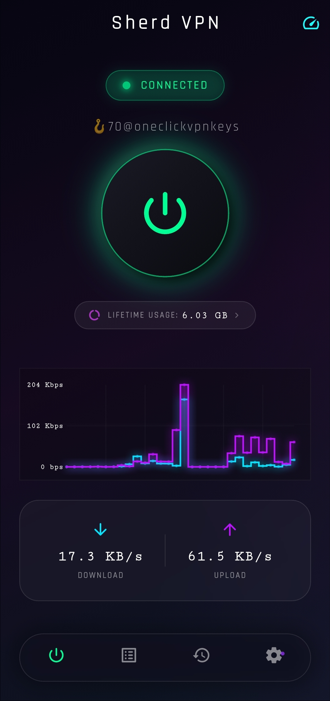
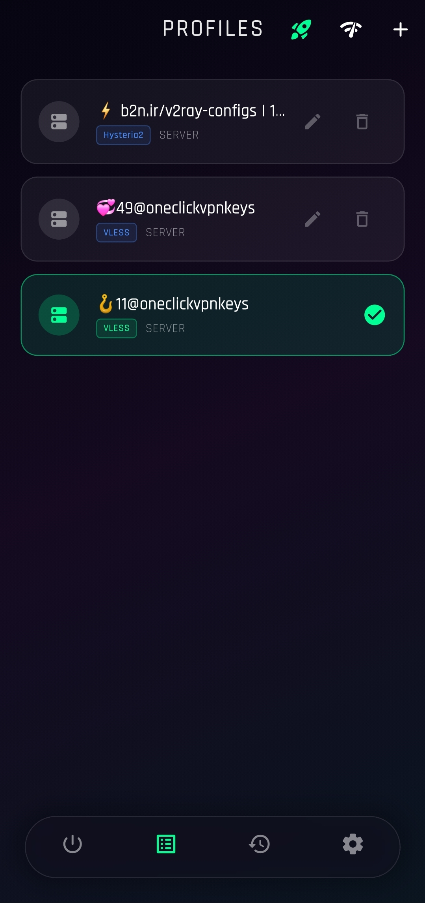
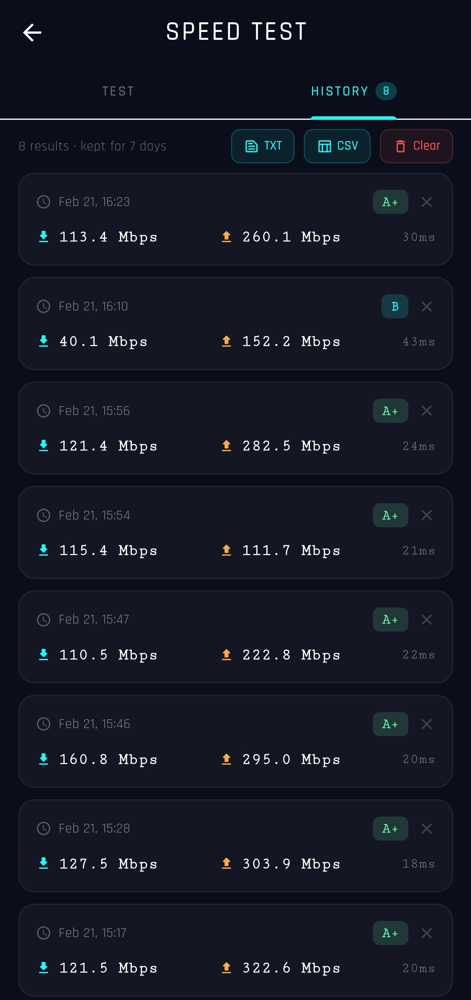
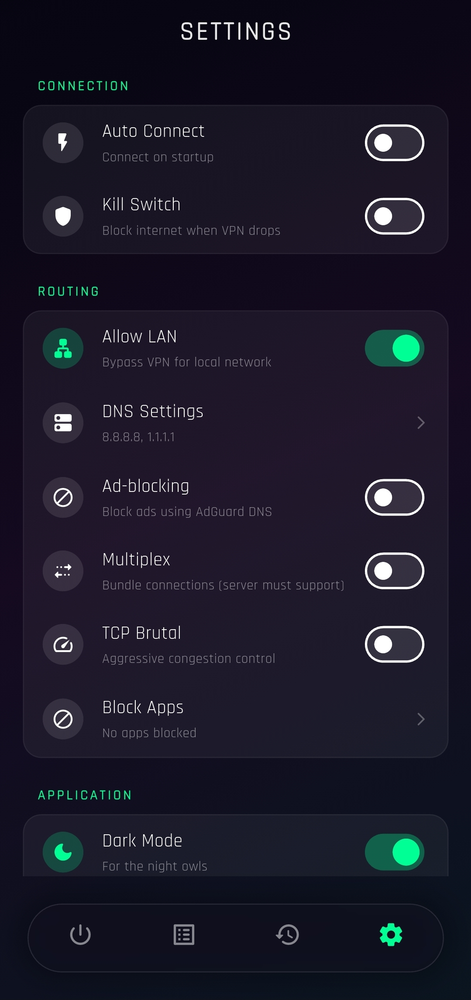
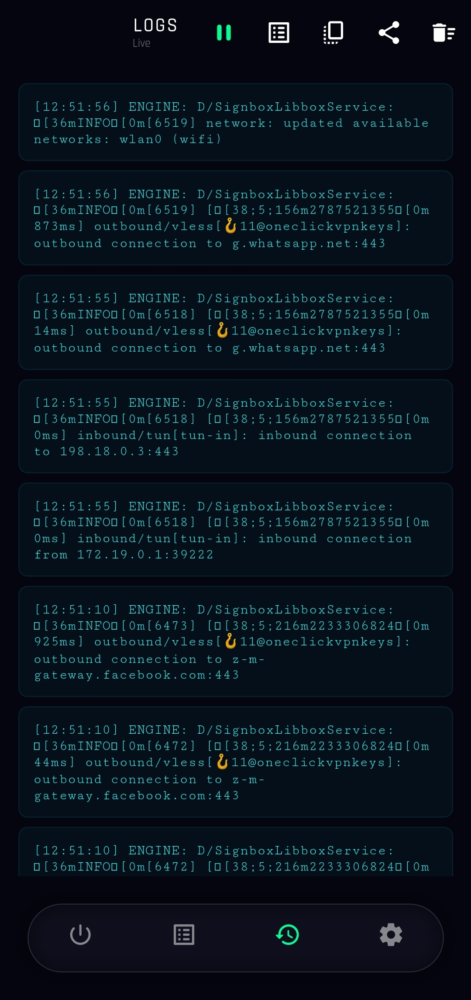
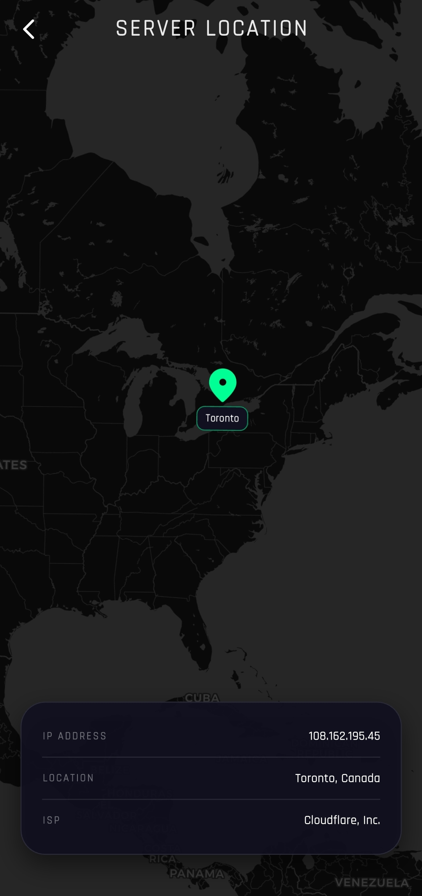

# Sherd VPN

Sherd VPN is a powerful and secure VPN application designed to provide a seamless browsing experience. Below are some highlights of the application's features.

## Application Preview

### 📱 Home Screen
The main dashboard of the Sherd VPN app, showing the connection status and primary controls.

### 🌍 Server Selection
A list of available high-performance servers for premium users.

### 🆓 Free Servers
Access to a variety of free servers for users to connect without a subscription.

### 📊 Connection Results
Detailed metrics and results after establishing a VPN connection.

### ⚡ Network Speed Test
Built-in speed test utility to measure upload and download speeds.

### ⚙️ Advanced Settings
Comprehensive configuration options for tailoring the VPN experience.

### 📝 Connection Logs
Real-time logs for monitoring the VPN connection and troubleshooting.

### 🗺️ Visual Maps
Geographical representation of server locations.

### 📂 Import Configuration
Interface for importing VPN configurations and profiles.

